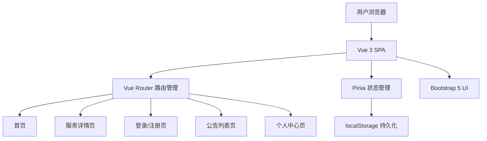

# 项目设计文档 - 校园生活服务平台

## 1. 系统架构

## 2. 数据模型

由于为纯前端项目（无数据库），数据通过 localStorage + JSON 模拟数据实现持久化。

### 核心数据实体

**用户 (User)**
| 字段 | 类型 | 说明 |
|------|------|------|
| id | number | 用户唯一标识 |
| username | string | 用户名 |
| password | string | 密码 |
| nickname | string | 昵称 |
| email | string | 邮箱 |
| phone | string | 手机号 |
| avatar | string | 头像URL |
| role | string | 角色(admin/user) |

**服务 (Service)**
| 字段 | 类型 | 说明 |
|------|------|------|
| id | number | 服务唯一标识 |
| title | string | 服务名称 |
| category | string | 服务分类 |
| description | string | 服务描述 |
| detail | string | 详细信息 |
| image | string | 服务图片 |
| location | string | 服务地点 |
| bookingMethod | string | 预约方式 |
| contact | string | 联系方式 |
| rating | number | 评分 |
| openTime | string | 开放时间 |

**公告 (Announcement)**
| 字段 | 类型 | 说明 |
|------|------|------|
| id | number | 公告唯一标识 |
| title | string | 公告标题 |
| content | string | 公告内容 |
| category | string | 公告分类 |
| publishTime | string | 发布时间 |
| author | string | 发布人 |
| isTop | boolean | 是否置顶 |

## 3. 接口清单

本项目为纯前端项目，无后端接口。数据通过 Pinia Store + localStorage 管理。

### Store 方法清单

**userStore**
- `login(username, password)` — 用户登录
- `register(userInfo)` — 用户注册
- `logout()` — 退出登录
- `updateProfile(profile)` — 修改个人资料
- `checkAuth()` — 检查登录状态

**serviceStore**
- `getServices()` — 获取全部服务列表
- `getServiceById(id)` — 根据ID获取服务详情
- `getServicesByCategory(category)` — 按分类获取服务
- `getCategories()` — 获取服务分类列表

**announcementStore**
- `getAnnouncements(page, pageSize, filter)` — 分页获取公告
- `getAnnouncementById(id)` — 获取公告详情
- `filterByTime(startDate, endDate)` — 按时间筛选

## 4. 页面清单

| 路由路径 | 页面名称 | 功能描述 |
|---------|---------|---------|
| / | 首页 | 校园公告轮播、热门服务分类卡片、校园地图入口 |
| /service/:id | 服务详情页 | 服务完整信息展示、预约方式说明（路由参数传递） |
| /login | 登录/注册页 | 双Tab切换登录与注册、表单验证、数据绑定 |
| /announcements | 公告列表页 | 分页展示公告列表、按时间筛选、公告卡片 |
| /profile | 个人中心页 | 用户信息展示、基本资料修改、头像修改 |

## 5. 示例数据规划

- **用户**: 2 个预置账号（admin/admin123, user/user123）
- **校园服务**: 8 条（涵盖洗衣、快递、辅导、打印、健身、维修、餐饮、出行）
- **校园公告**: 10 条（涵盖教务通知、活动公告、安全提醒等，跨越不同月份）
- 数据文件位置: `src/data/mock.js`
- 注入方式: Pinia Store 初始化时从 mock 加载，用户操作后写入 localStorage

## 6. 前端设计规范

### 6.1 设计方向
- 美学风格：清新学院风 + 现代卡片化设计
- 设计关键词：清新、活力、信任、校园、年轻化
- 参考：融合学院蓝与自然绿的现代 Web 设计，强调信息层级与卡片布局

### 6.2 色彩体系
- 主色 (Primary): `#2563EB` — 学院蓝，导航栏、主按钮、链接
- 辅色 (Secondary): `#059669` — 校园绿，成功状态、辅助按钮
- 强调色 (Accent): `#F59E0B` — 活力橙，徽章、重点标记、评分
- 中性色阶梯: `#F8FAFC`(50) / `#F1F5F9`(100) / `#E2E8F0`(200) / `#94A3B8`(400) / `#64748B`(500) / `#334155`(700) / `#1E293B`(800) / `#0F172A`(950)
- 语义色: Success `#10B981` / Warning `#F59E0B` / Error `#EF4444` / Info `#3B82F6`
- 60-30-10: 60% 浅灰背景 / 30% 白色卡片 / 10% 主色强调

### 6.3 字体体系
- 标题字体: Poppins (英文) + Noto Sans SC (中文) — Google Fonts
- 正文字体: Noto Sans SC — Google Fonts
- 字号阶梯: xs(12px) / sm(14px) / base(16px) / lg(18px) / xl(20px) / 2xl(24px) / 3xl(30px) / 4xl(36px)
- 行高: 正文 1.6 / 标题 1.3
- 字重: Regular(400) / Medium(500) / Semibold(600) / Bold(700)

### 6.4 间距与布局
- 基准单位: 4px
- 间距阶梯: 4 / 8 / 12 / 16 / 24 / 32 / 48 / 64
- 布局: Bootstrap 12列栅格 + Flex/Grid
- 响应式断点: sm(576px) / md(768px) / lg(992px) / xl(1200px) / xxl(1400px)

### 6.5 组件规范
- 圆角: sm(4px) / md(8px) / lg(12px) / xl(16px)
- 阴影层级: sm(0 1px 3px) / md(0 4px 12px) / lg(0 8px 24px)
- 卡片: 白色背景 + md阴影 + 8px圆角 + hover提升效果
- 按钮: 四态(default/hover/active/disabled) + loading态

### 6.6 动效规范
- 过渡时长: 快(150ms) / 中(250ms) / 慢(400ms)
- 缓动函数: cubic-bezier(0.4, 0, 0.2, 1)
- 页面级: 路由切换 fade-slide 过渡 (300ms)
- 区块级: 卡片入场 fadeInUp 动画 (stagger 80ms)
- 元素级: 按钮 hover scale(1.02)，输入框 focus 边框高亮

### 6.7 平台适配说明
- 目标平台: Web 浏览器
- 鼠标 hover + 键盘交互
- 使用 Bootstrap 响应式栅格，适配 375px ~ 1920px 宽度

### 6.8 图片与媒体资源清单
- 首页 Banner: 1-2 张校园风景图 (Unsplash)
- 服务分类图标: Bootstrap Icons (SVG)
- 服务列表缩略图: 各服务场景图 (Unsplash)
- 用户默认头像: 通用头像图标 (Bootstrap Icons)
